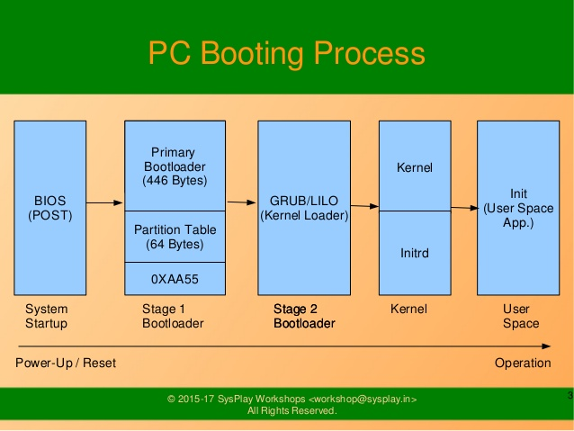
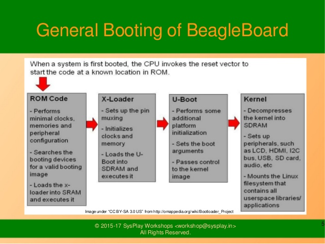

## BBB boot process overview

### The BBB Boot Process

The BBB SD card is physically attached to MMC0 and the eMMC to MMC1.

This is always the way the ROM, MLO and u-boot see these devices.

Linux userland can see the eMMC as /dev/mmcblk0 or /dev/mmcblk1 depending on whether an SD card is present.

There are 4 stages to the BBB boot process.

	[1] The built-in ROM (first-stage) loads at powerup and immediately looks for a second-stage bootloader with a known name 'MLO' on the boot device's first partition formatted as FAT.

	[2] The MLO does some basic initialization and loads a third-stage bootloader, the full u-boot.img, from the same boot device.

	[3] U-boot loads the zImage kernel and a DTS into memory and boots the kernel with some command line arguments.

	[4] The Linux kernel boots and loads the root filesystem

ROMs on some other boards can only look for the first-stage bootloader at fixed locations in unpartitioned space. The BBB can do this as well, but the BBB ROM also knows how to read files from a FAT filesystem.

Install scripts and system debug and maintenance are simplified using named files on the FAT filesystem.

NOTE: The BBB ROM does always search for the MLO at fixed locations first, so there is a tiniest bit of boot time that can be saved by loading the MLO at a fixed location in unpartitioned space.

By default, the first boot device is the eMMC (MMC1).

Holding down the S2 'boot' switch on the BBB when powering (or temporarily grounding P8.43) tells the ROM that the SD card (MMC0) should be the first boot device.

If no MLO is found on the eMMC, the ROM will try the SD card automatically.

The MLO always loads the u-boot.img from the same device it's running from.

The built-in environment in u-boot loads a default am335x-boneblack.dts to pass to the kernel at boot.

To override this default DTS, a uEnv.txt configuration file can be used to customize the u-boot environment. In the uEnv.txt you can explicitly specify a different DTS as well as the command line arguments to pass to the kernel.

There is no initrd used with the Venus BBB builds. U-boot goes directly to the final kernel.

### Note

By default, the BBB u-boot always looks for a kernel and DTS from the SD card (MMC0) before the eMMC (MMC1) regardless of the boot device that MLO and u-boot.img loaded from.

This is a new 'feature' in u-boot.

This feature does allows for testing new kernels and rootfs systems without having to install onto the eMMC.

On the downside, every eMMC boot is now slowed slightly as u-boot looks for a kernel and DTS on the SD card, fails when there is no card present or it can't find a zImage or dts, and then tries again from the eMMC.

Disabling this behavior requires a rebuild of u-boot.

### References

AM335x Sitara Processors TRM (spruh73l) Section 26.1.7.5
BeagleBone Black System Reference Manual Rev C.1 Section 6.7

### BBB booting process
https://www.slideshare.net/sysplay/beaglebone-black-booting-process-78730088

