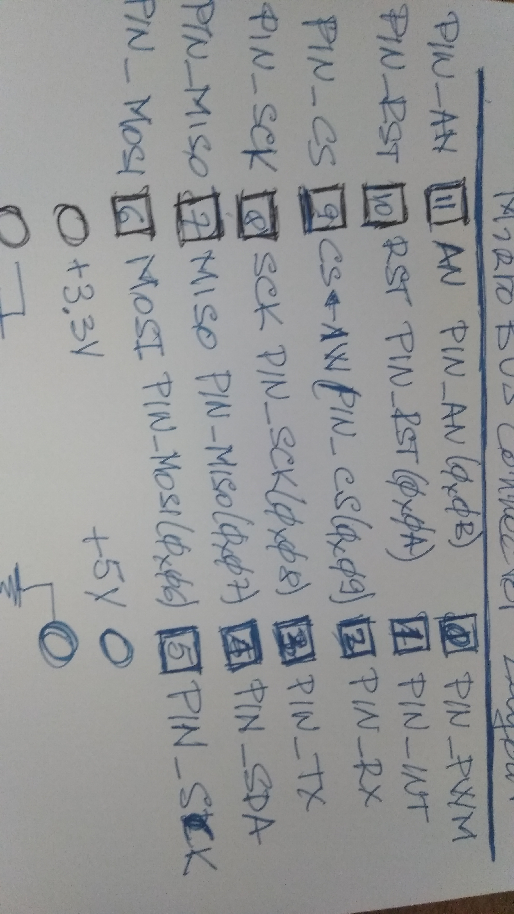

### MikroE MikroBus

https://raw.githubusercontent.com/wiki/beagleboard/pocketbeagle/images/mikrobus-socket-pinout.jpg

#### From mikrobus_id.c

	#define W1_EEPROM_MIKROBUS_ID   0xAC

#### From mikrobus_core.h

	enum mikrobus_pin {
		MIKROBUS_PIN_PWM        = 0x00,
		MIKROBUS_PIN_INT        = 0x01,
		MIKROBUS_PIN_RX         = 0x02,
		MIKROBUS_PIN_TX         = 0x03,
		MIKROBUS_PIN_SCL        = 0x04,
		MIKROBUS_PIN_SDA        = 0x05,
		MIKROBUS_PIN_MOSI	= 0x06,
		MIKROBUS_PIN_MISO	= 0x07,
		MIKROBUS_PIN_SCK        = 0x08,
		MIKROBUS_PIN_CS         = 0x09,
		MIKROBUS_PIN_RST        = 0x0A,
		MIKROBUS_PIN_AN         = 0x0B,
		MIKROBUS_PORT_PIN_COUNT = 0x0C,
	};
