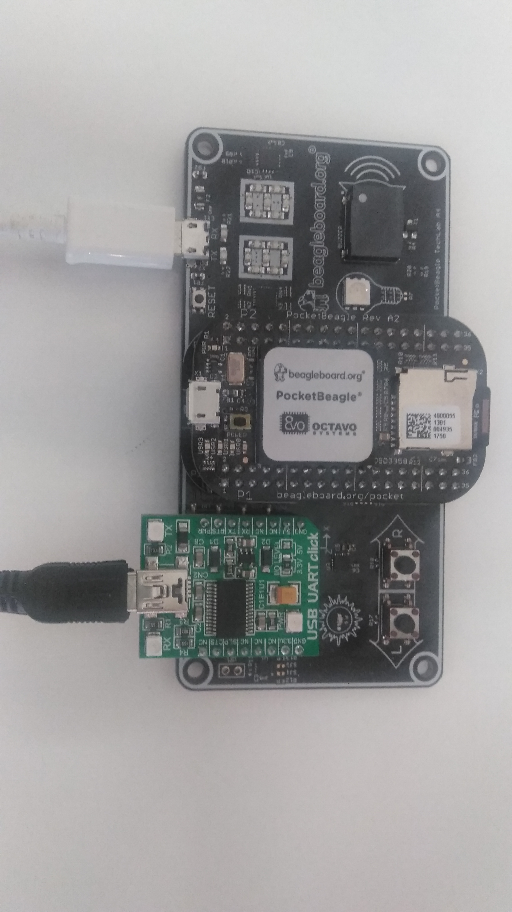

### Techlab Cape and Pocket Beagle USB serial ports for RS232 interfaces

There are three possible USB serial ports for RS232 on the following configuration:

UART0 is the default boot console on PB.

#### The techlab cap FTDI's USB serial port for RS232 on board, mapped to the UART0:

	UUID:			5d6b4dfd-4151-4048-a37e-f04674b8da30
	VendorId:		0x0403 (0403)
	ProductId:		0x6015 (6015)
	Revision:		16.0 (1600)
	Port:			3
	USB version/speed:	2/Full
	Manufacturer:		FTDI
	Product:		FT230X Basic UART
	SerialNumber:		DO01J2F7
	Address:		sysfs:/sys/devices/pci0000:00/0000:00:14.0/usb2/2-3/2-3.4//device:/dev/vboxusb/002/070

#### The Pocket Beagle's USB serial port for RS232, mapped to the UART0:

	UUID:			fc9a7f1e-b486-48d9-b6a6-5805b0d62f3d
	VendorId:		0x1d6b (1D6B)
	ProductId:		0x0104 (0104)
	Revision:		4.4 (0404)
	Port:			3
	USB version/speed:	2/High
	Manufacturer:		BeagleBoard.org
	Product:		BeagleBoneBlack
	SerialNumber:		1750EPB04935
	Address:		sysfs:/sys/devices/pci0000:00/0000:00:14.0/usb2/2-3/2-3.4//device:/dev/vboxusb/002/064

#### The USB UART click's - Breakout board for FT232RL chip converter, mapped to the UART0:
https://www.mikroe.com/usb-uart-click

	UUID:			45040e7e-c85a-44e0-b45f-a181a51a1743
	VendorId:		0x0403 (0403)
	ProductId:		0x6001 (6001)
	Revision:		6.0 (0600)
	Port:			3
	USB version/speed:	2/Full
	Manufacturer:		FTDI
	Product:		FT232R USB UART
	SerialNumber:		AQ00DYT4
	Address:		sysfs:/sys/devices/pci0000:00/0000:00:14.0/usb2/2-3/2-3.4//device:/dev/vboxusb/002/075
