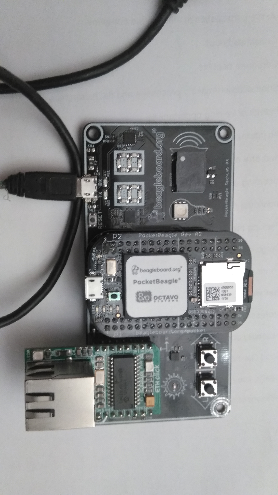

### BBB_PB-Workshop-Examples

This git was created in order to capture Beagle Bone Black (BBB) as well as Pocket Beagle (PB)
Embedded Linux Lecture: Linux/C/GIT.

Most of the parts of this repo are the same for BBB and PB platforms.

The obvious differences between BBB and PB platforms are .dtb and .dtbo files.

For BBB platform there is an am335x-boneblack.dtb to be used.

For PB platform there is an am335x-pocketbeagle.dtb to be used.

The distro represented in the Linux embedded BBB/PB course is Debian Buster.

It is rather loose recommendation/heuristic than deterministic approach/method.

### Pocket Beagle configuration

The platform on the picture runs Debian Buster Linux distro (from SDcard).

The USB cable on the picture is ONLY one, used for Power Supply (powering from the notebook's
USB port), as well as console (UART to USB) cable (very powerful, isn't it?).

The ETH click attached to the PocketBeagle Techlab Cape is SPI to ETH, for the www network.
